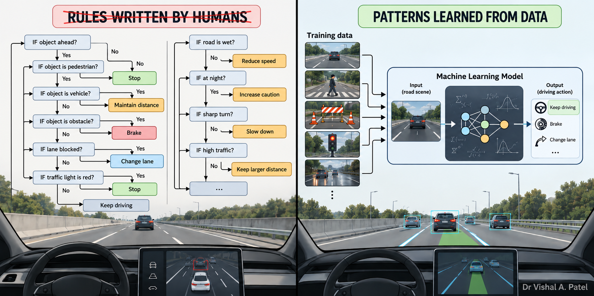

# Introduction
`Machine learning` is a very fascinating word. When I first heard this word, I had all those fancy images of robots performing tasks on their own. I got interested in machine learning during my undergraduate days. The core driving force for me was a love for automation. I was always interested in automating tasks, but automating tasks requires us to write explicit rules. 

